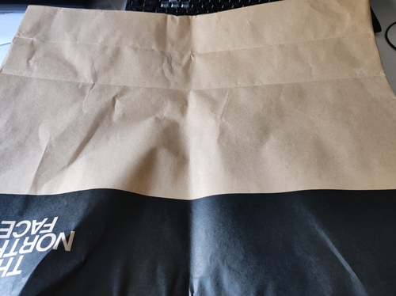
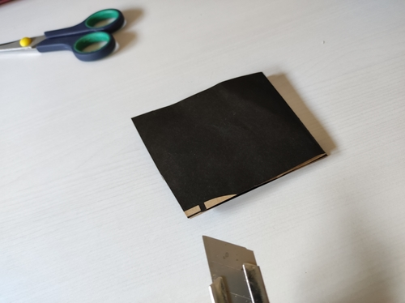
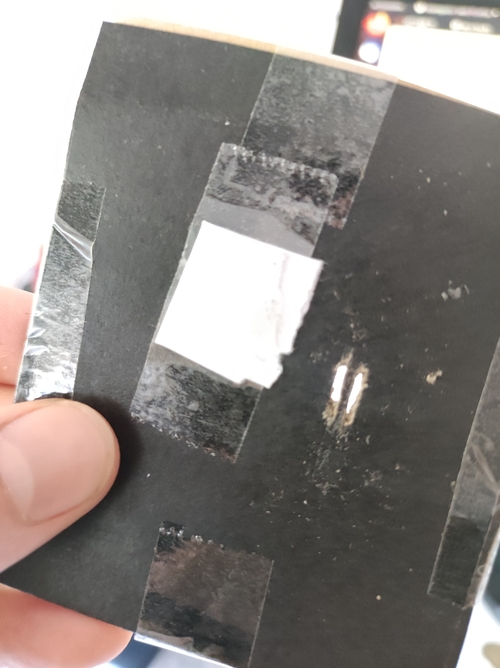
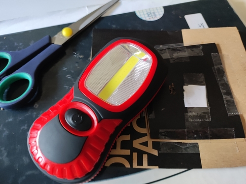
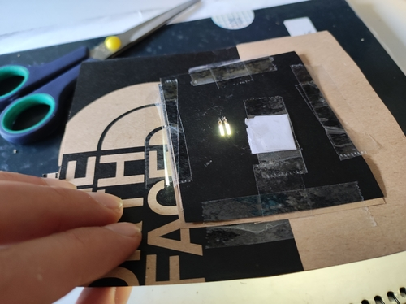
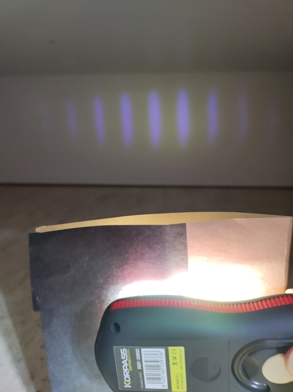

# Experimento de la doble rendija más cutre possible.

Estuve mirando por internet ejemplos del experimento de la doble rendija y casi todos utilizaban un laser. Yo como no tengo laser voy a usar una linterna.

## Material

* Bolsa cartón
* Cúter
* Tijeras (quizá)
* Celo
* Linterna

Para hacer la doble rendija he usado una bolsa de cartón/papel de The North Face.

He cortado un trozo:

Y luego con el cúter he hecho los agujeros. 

Como se ve, la he cagado la primera vez: Las dos rendijas se han vuelto una sola (es muy fácil destrozar el cartón, sobretodo si el cúter no está bien afilado). Lo he tapado con un trozo de papel y lo he vuelto a intentar. Para el segundo (y último) intento me ha servido poner celo antes de cortar, ya que le da un extra de consistencia al cartón. Además, he usado unas tijeras para limpiar los agujeros y que la luz pase bien.

Finalmente, me he dado cuenta que el trozo de cartón era muy pequeño y salia luz por los costados, así que lo he pegado a un trozo de cartón más grande, al que previamente le he hecho un agujero en el centro. En la imagen también se ve la linterna que voy a usar.

Aquí se ve como pasa la luz a través de las rendijas:

Y finalmente los resultados. He utilizado el espacio debajo de mi cama, pero cualquier sitio poco iluminado debería servir.

